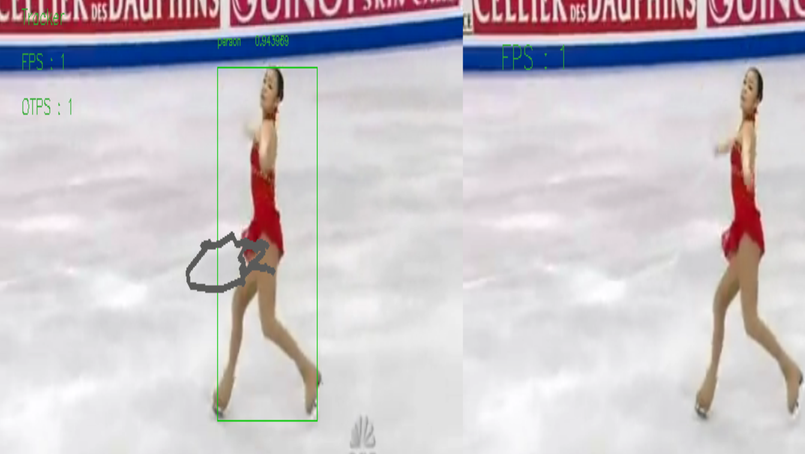

# Qualcomm® QCS610 SoC Open Kit objectTraker-demo Developer documentation

## Introduce

This project is based on [Qualcomm Neural processing SDK for AI]("https://developer.qualcomm.com/software/qualcomm-neural-processing-sdk"). Using the [Qualcomm® QCS610 SOC Open Kit](https://developer.qualcomm.com/software/qualcomm-neural-processing-sdk) as core development board. Then, its powerful computing ability will been show by a object tracking demo is completed that combine with Qualcomm Neural processing SDK for AI, Gstreamer,OpenCV and open source of YUV. Among them, the model adopted is converted from Caffe's Goturn model to Qualcomm Neural processing SDK for AI's DLC model.Gstreamer is used to get video streams that need to be tracked for objects.OpenCV is mainly used for simple processing of pictures.YUV is used to convert video frames to image formats.

The project was built in x86 host with across complier tool and has been tested in Qualcomm® QCS610 SoC device.The whole framework was re split and changed in this version. The parsing video frame was separated into a single thread from the image, target tracking and the added display part. Gstcamera was re-encapsulated to support multi-channel tracking.At the same time, the project parameter configuration module is added, and the configuration can be completed by filling in the config.ini file.

<center>Qualcomm® QCS610 SoC Development board</center>


## Materials and Tools used for the project

1. Hardware materials

Except for the development board,The following hardware materials are also needed:

* Type-C usb line

using the usb line to develop on Qualcomm® QCS610 SoC development board.


* Charger

Direct power supply for Qualcomm® QCS610 SoC development board


* DP-Line

using the universal dp line to connect LED displayer to  Qualcomm® QCS610 SoC development board.


* LED-Displayer

using a LED Displayer to display the objectTracker-demo interface from Qualcomm® QCS610 SoC development board.


## Environment configuration

This section mainly describes the source and configuration of some open source projects or third-party tools needed in the development process.

### Qualcomm Neural processing SDK for AI

1. Download the Neural Processing SDK from here:
   [https://developer.qualcomm.com/software/qualcomm-neural-processing-sdk](https://developer.qualcomm.com/software/qualcomm-neural-processing-sdk)
2. Git clone this project link [https://github.com/ThunderSoft-XA/C610-objectTracker-demo/](https://github.com/ThunderSoft-XA/C610-objectTracker-demo/)
3. Move the Neural Processing SDK contents to <C610-objectTracker-demo/snpe/include/zdl>

### OpenCV

The version of OpenCV is 3.4.3.There are many tutorials for opencv installation on the network.Therefore, you can completely refer to other people's installation methods for installation and configuration.For example:[https://www.cnblogs.com/uestc-mm/p/7338244.html](https://www.cnblogs.com/uestc-mm/p/7338244.html)

### YUV

[**libyuv**](https://github.com/lemenkov/libyuv) is an open source project that includes YUV scaling and conversion functionality.

You can call it directly if already cloned it.Than,move all file to the yuv directory of project.

* Scale YUV to prepare content for compression, with point, bilinear or box filter.
* Convert to YUV from webcam formats for compression.
* Convert to RGB formats for rendering/effects.
* ........

### config

The [config](https://github.com/ndevilla/iniparser) is open project,it used to parse config.ini configuration files.

## Compile

The compilation of the whole project is based on the yocto compilation tool, so you need to write some .bb and .conf files according to the specification. The link is [objecttrack_0.1.bb](https://github.com/ThunderSoft-XA/C610-objectTracker-demo/blob/master/C610-objectTracker-demo/objecttrack_0.1.bb) example.

Please refer to [the official Manual of Yocto](https://www.yoctoproject.org) for how to add layers,write layer.conf .Then,excute the command as follows:

```
bitbake objecttrack
```

you will get a  executable bin file named objectTracker.Move it to the root of the source code.Next,push the whole project code to Qualcomm® QCS610 SoC device`s dir /data/.

```
adb root && adb disable-verity && adb reboot

adb root &&adb remount && adb shell mount -o remount,rw /

adb push xxx/xxx/sourcepath /data/

adb shell

cd data/objectTracker-demo
```

## Configure Weston and Usage

### 1. Configure Weston

To Download *Turbox-C610-aarch64_AI_Demo_Firmware.tgz*, go to: TBU

Push the *firmware package* to target device's */data/* directory.

```
$ adb root
$ adb disable-verity && adb reboot
$ adb root && adb shell mount -o remount,rw /
$ adb push Turbox-C610-aarch64_AI_Demo_Firmware.tgz  /data/
$ adb shell
$ tar -zxvf /data/ Turbox-C610-aarch64_AI_Demo_Firmware.tgz  -C /data/
```

Unpack *Turbox-C610-aarch64_Weston_DP_Firmware.tgz* under root directory to enable weston output to DP.

```
$ tar -zxvf /data/ Turbox-C610-aarch64_AI_Demo_Firmware/aarch64-weston-dp.tgz -C /
```

### 2. Usage

This project only provides a simple command line interface.

run objectTracker：

Run the **objectTracker-demo** app.The demo video will play on the DP screen.

[weston_dp_client script](https://github.com/ThunderSoft-XA/C610-objectTracher-demo2.0/blob/master/objectTracker-2.0/weston_dp_client)

```

$ cd /data/<source root dir>
$ ./weston_dp_client objectTracker
```

# Result

The object tracking results are as follows：



Note:

The gray part in the middle of the image is the track map of the athlete. Because the athlete is always near the center of the video, her track is almost concentrated in that area.You may be surprised that the frame rate is only 1 FPS, but it runs in CPU mode. It should be much better to switch to GPU mode.
